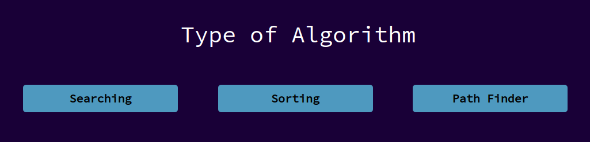
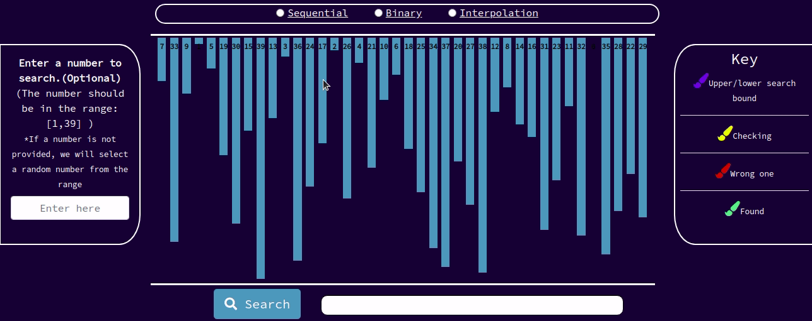
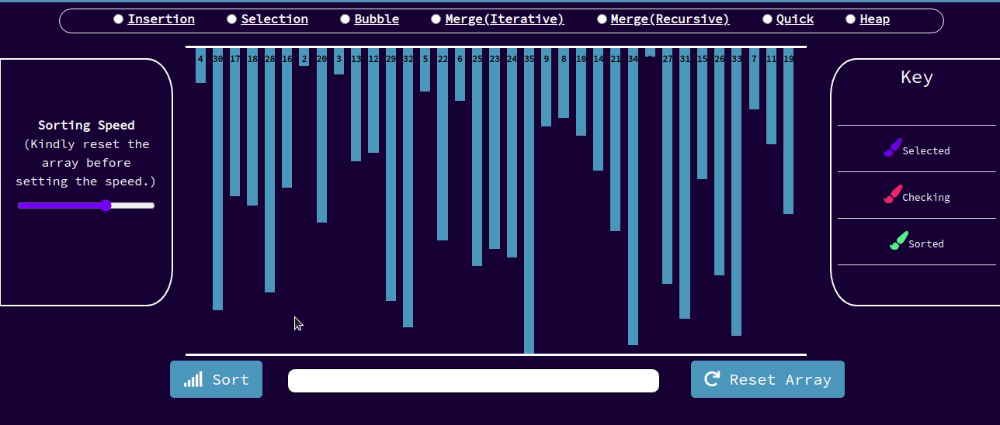
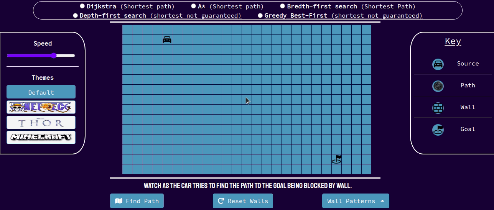

# AlgoVision
Interactive visual education tool for all your favorite computer science concepts!

## Supported algorithms
- [Search](algovision/static/js/searching.js)
  - [Sequential](https://github.com/pran01/AlgoVision/blob/master/algovision/static/js/searching.js#L96)
  - [Binary](https://github.com/pran01/AlgoVision/blob/master/algovision/static/js/searching.js#L126)
  - [Interpolation](https://github.com/pran01/AlgoVision/blob/master/algovision/static/js/searching.js#L171)
  
- [Sort](https://github.com/pran01/AlgoVision/blob/master/algovision/static/js/sorting.js)
  - [Insertion Sort](https://github.com/pran01/AlgoVision/blob/master/algovision/static/js/sorting.js#L113)
  - [Selection Sort](https://github.com/pran01/AlgoVision/blob/master/algovision/static/js/sorting.js#L163)
  - [Bubble Sort](https://github.com/pran01/AlgoVision/blob/master/algovision/static/js/sorting.js#L210)
  - [Quick Sort](https://github.com/pran01/AlgoVision/blob/master/algovision/static/js/sorting.js#L523)
  - [Merge Sort (Iterative)](https://github.com/pran01/AlgoVision/blob/master/algovision/static/js/sorting.js#L294)
  - [Merge Sort (Recursive)](https://github.com/pran01/AlgoVision/blob/master/algovision/static/js/sorting.js#L413)
  - [Heap Sort](https://github.com/pran01/AlgoVision/blob/master/algovision/static/js/sorting.js#L634)
  
- [Path-Finding](https://github.com/pran01/AlgoVision/blob/master/algovision/static/js/pathfinding.js)
  - [Breadth First Search](https://github.com/pran01/AlgoVision/blob/master/algovision/static/js/pathfinding.js#L791)
  - [Depth First Search](https://github.com/pran01/AlgoVision/blob/master/algovision/static/js/pathfinding.js#L825)
  - [Dijkstras](https://github.com/pran01/AlgoVision/blob/master/algovision/static/js/pathfinding.js#L867)
  - [A* Star](https://github.com/pran01/AlgoVision/blob/master/algovision/static/js/pathfinding.js#L933)
  - [Greedy Best-First Search](https://github.com/pran01/AlgoVision/blob/master/algovision/static/js/pathfinding.js#L997)
  

## TODO
- [ ] Maze generation
  - [ ] Randomized Kruskal's
  - [ ] Randomized Prim's
  - [ ] Wilson's algorithm
  - [ ] Aldous-Broder algorithm
- [ ] Machine learning
  - [ ] Neural Networks
  - [ ] Genetic Algorithms
- [ ] Cryptography
  - [ ] AES
  - [ ] RSA
  - [ ] DES
  - [ ] Enigma
